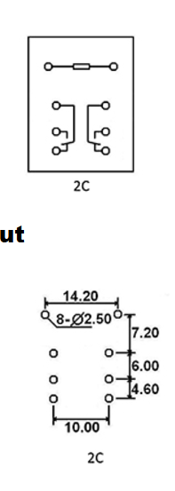

# J1512CP120VAC1.2 relay

This is a general purpose relay that is rated for 120VAC, and can safely switch 20Amps.

manufacturer website: [https://citrelay.com/view_relay.php?series=J151](https://citrelay.com/view_relay.php?series=J151)

[PDF datasheet](J151.pdf) from local file (downloaded from [web version](https://www.citrelay.com/Catalog%20Pages/RelayCatalog/J151.pdf)).

